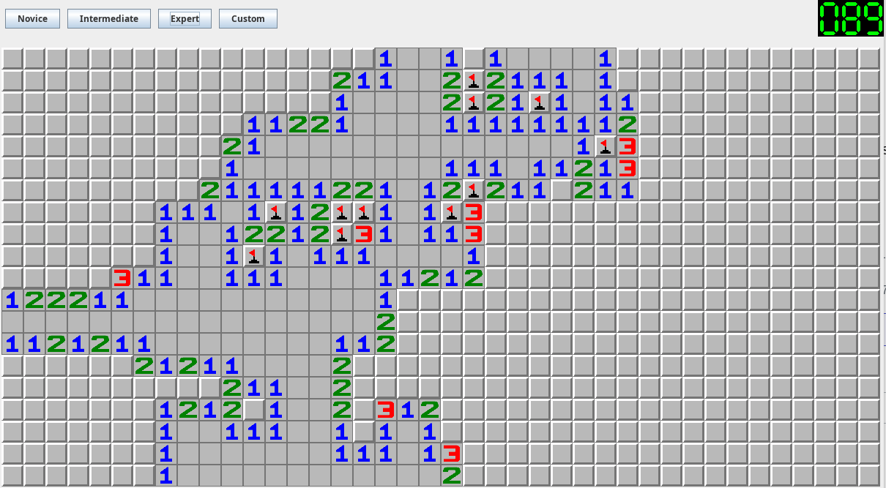

# Minsweeper in Java

My own version of minesweeper which I always wanted.

At beggining biggest empty patch is revelaed automatically.

Right click mark mine.

Left click reveal cell or when you click on number and amount of mines in patch is same as as number other cells are revealed.

I created small segment display to show number of mines.

Window is full resizable

## Screenshot

